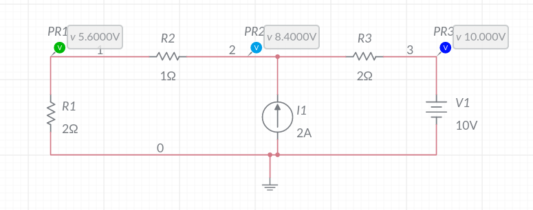

# Node Voltage Analyzer with Rust

This project uses the Kirchhoff's current law (KCL) to obtain the voltage at the nodes of the circuit. Where the circuit is fed to the program in the form of a netlist, similar to those used in PSPICE-like software. 

### Features

* Convention used to solve the circuit is KCL with incoming_current - leaving_current = 0
* It solves electric circuits receiving as an input a file containing the NetList of the circuit.
* It is capable of solving circuits with the following configurations:
    * It is a linear circuit.
    * It only has one or many independent voltage and/or current sources.
    * It has one or many resistors.

### How it works

Everything is more clearly understood with an example.

**Figure 1. Circuit results/test4.txt**

Figure 1 shows us the circuit solved with the help of Online Multisim.
A more detailed schematic of how calculations are performed in the program are explained in the following figure.

**Figure 2. Circuit schematic with nodal currents**

Figure 2 shows us the circuit by which we can build our netlist, once we label all our electric components and nodes and all current directions are set. Electric current must always flow from a higher potential to a lower one, so there is never a current which flows from node 0, or ground, to a higher potential. With that in mind, the NetList of the figure 1 circuit results in:

**Table 1: NetList of the circuit**

Component | Starting Node | Ending node | Value 
----------|---------------|-------------|-------
v1 | 3 | 0 | -10
i1 | 2 | 0 | -2
r1 | 1 | 0 | 2
r2 | 1 | 2 | 1
r3 | 2 | 3 | 2

The NetList is comprised of the following elements:
* Component. It is the component's name which the program only accepts _i_ or _v_, where _i_ stands for independent current source and _v_ for independent voltage source. It is case insensitive.
* Branch. The branch contains the current's direction from the starting node to the ending node.
* Value. The component's value. It can be in the following units V, A or Ohms, depending the component. If the current or voltage source is in opposite direction of the current we have set for our schematic then its value must be negative.

With all set the only thing to do is to run the project.

`cargo run ./tests/test4.txt`

The above command prints in the console the following results.

|**Matrix A** |
|------------|------------|---------
| 1.5000     | -1.0000    | 0.0000    
| -1.0000    | 1.5000     | 0.0000      
| 0.0000     | 0.0000     | 1.0000 

**Matrix b**
-----------|
0.0000   
7.0000   
-10.0000 

**Result [V]**
-------------|
V1: 5.6000
V2: 8.4000
V3: -10.0000

